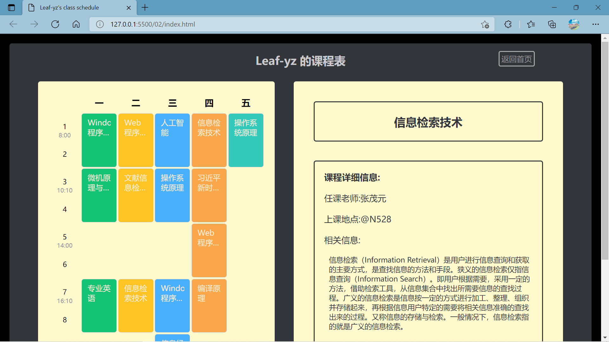

## 任务描述:
设置一个课表网页，要求分左右两栏，左边为课表，只显示课程名称，当鼠标移动到课表中某一个课表的单元格时，在右边显示课程的详细信息

## 技术选型
### css:
grid 网格布局
### js:
onmouseover 事件
\井游戏demo 的事件驱动方式

## 实现思路
1. 在页面左边使用 grid 构建出基本的课程表
   使用 js 动态创建 html 代码,填充课程表内容,并配置其 grid 位置
2. 在页面右边使用 grid 构建出基本显示的框
   主要显示信息: 课程名 课程具体内容-任课教师-授课地点-相关信息
3. 关于事件响应的触发
   但鼠标处于 课程位于的 grid 位置时,触发 mouseover 并响应课表详细内容,当鼠标移出课表内容后,触发 mouseout ,响应清除恢复函数

## 实验结果截图
